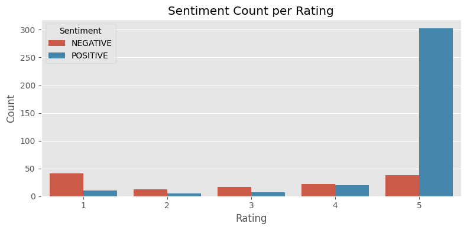
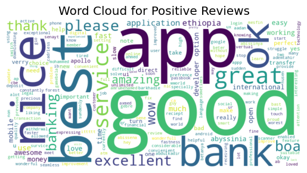
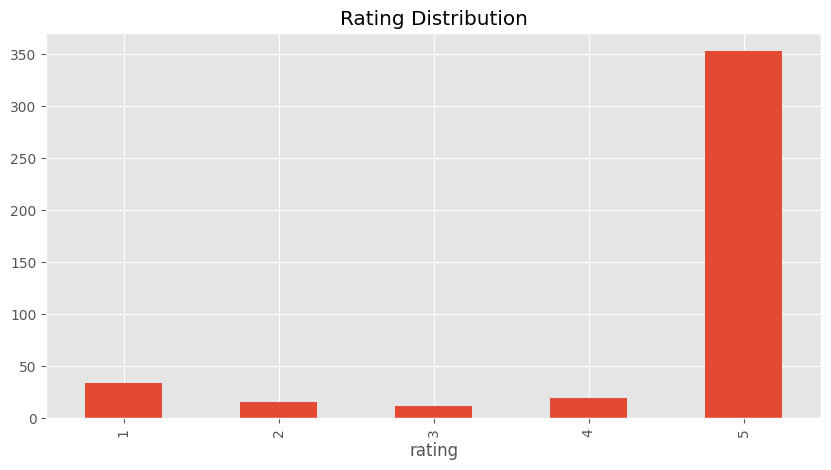

# Insights and Recommendations for Customer Experience Analytics

## 1. Sentiment Analysis Insights

The sentiment distribution across the three banks reveals distinct patterns:

### Commercial Bank of Ethiopia (CBE) and Dashen Bank

- **High proportion of positive reviews:** 71% for CBE, 76% for Dashen.
- **Few negative reviews overall:** Most 1-star ratings show minimal negativity.
- **Strong correlation between 5-star ratings and positive sentiment:** Satisfied users appreciate the app’s functionalities.

### Bank of Abyssinia (BOA)

- **Higher negative sentiment:** 25% negative vs. 46% positive.
- **1-star ratings align with strong negative sentiment:** Indicates critical customer frustration.
- **Mixed experiences at 5-star level:** Some positive reviews even among top ratings.

> **Insight:** BOA faces significant dissatisfaction among its lowest-rated users, requiring urgent intervention.

---

## 2. Thematic Analysis Insights

Your identified themes—**Performance Issues, Authentication Problems, User Interface, and Application Bugs**—paint a clear picture of customer concerns.

- **Application Bugs:**  
    - Recurring issue across lower-rated reviews, especially for BOA.
    - Users report crashes and unexpected errors, directly impacting satisfaction.
    - Likely a major contributor to BOA’s negative sentiment.

- **Performance Issues:**  
    - Complaints about slow loading times, particularly in transaction processes.
    - Notable across multiple banks, but less critical than application bugs.

- **Authentication Problems:**  
    - Login errors are a persistent frustration for users across all banks.
    - Reduces trust in the apps.

- **User Interface:**  
    - Higher-rated reviews praise ease of use, especially for CBE and Dashen.
    - Visual and navigational design is not a major pain point—technical reliability matters more.

---

## 3. Data-Driven Recommendations

### For Commercial Bank of Ethiopia (CBE) & Dashen Bank

- ✅ **Maintain usability strengths:** Continue improving navigation and simplicity to reinforce user satisfaction.
- ✅ **Optimize app performance:** Address performance-related complaints (e.g., slow transactions) to further enhance experience.
- ✅ **Prevent potential issues:** Proactively monitor bug reports to sustain high satisfaction levels.

### For Bank of Abyssinia (BOA)

- ⚠️ **Prioritize fixing critical application bugs:** Address stability and crash issues urgently.
- ⚠️ **Improve authentication reliability:** Enhance security and accessibility to restore user trust.
- ⚠️ **Investigate transaction performance:** Optimize app speed and backend processing to boost satisfaction.
- ⚠️ **Use sentiment insights for targeted fixes:** Replicate successful features and eliminate critical weaknesses.

---

## 4. Visualization Interpretation

- **Sentiment Count Per Rating:**  
    Confirms low ratings often correlate with negative sentiment, especially for BOA.
    !
- **Word Cloud for Top Keywords:**  
    Highlights dominant concerns (bugs, authentication, performance), reinforcing thematic conclusions.
    

- **Rating Distribution Per Bank:**  
    Shows BOA struggles more with dissatisfaction compared to CBE and Dashen.

> These visualizations support the need for targeted improvements, especially around app reliability and performance.

---

## 5. Next Steps

- Deep dive into bug-related complaints—categorize error types and identify recurring patterns.
- Enhance visualization depth—plot sentiment trends over time to detect ongoing improvement areas.
- Engage in comparative analysis—benchmark app performance against global fintech competitors.
- Recommend implementation strategies—suggest concrete UX/UI redesigns and backend optimizations for BOA.